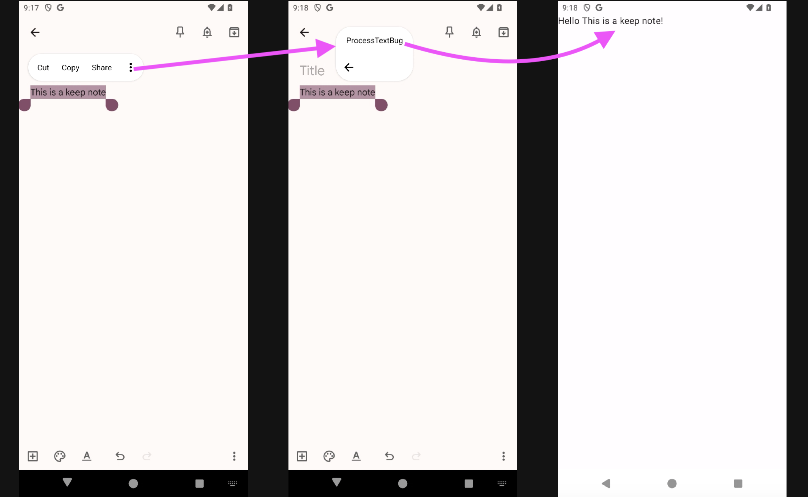
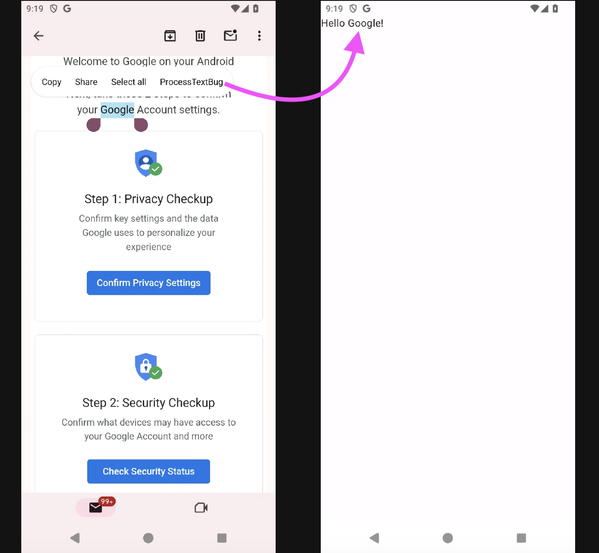
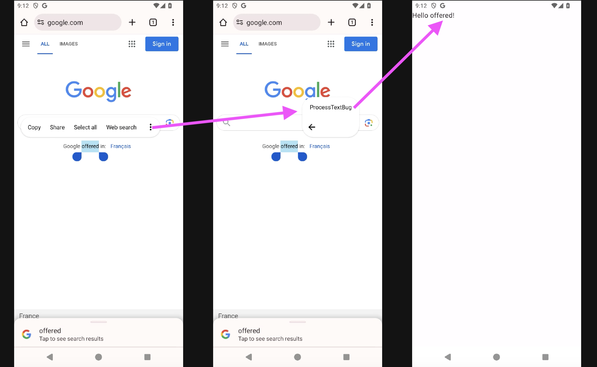
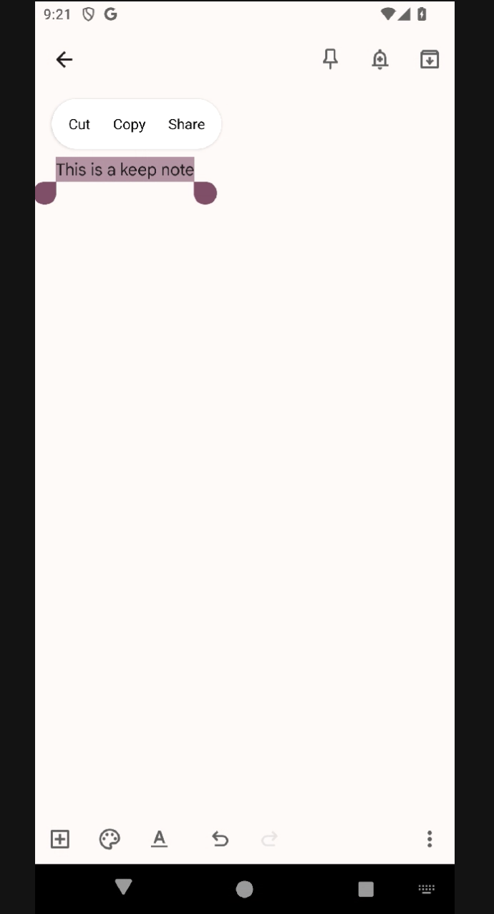
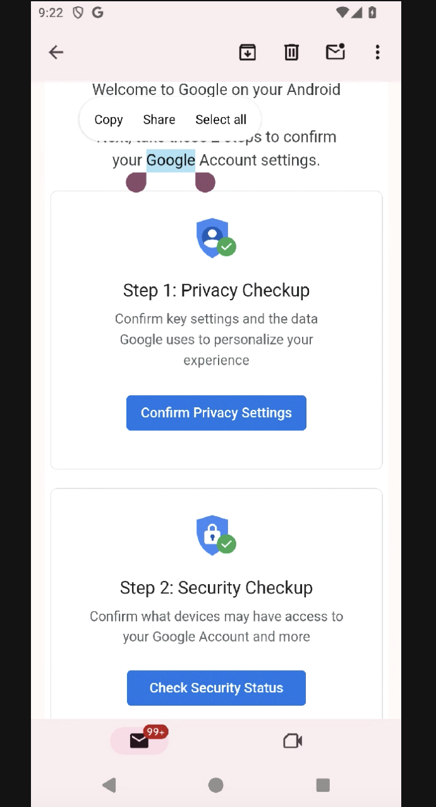

# ProcessText bug reproduction demo

## App functionality
This app displays the text "Hello `processText`", where `processText` is the `EXTRA_PROCESS_TEST` extra passed to the activity's `Intent`. 

When launching the app from the launcher, this intent extra isn't present, and the app displays "Hello No processed text".

When launching the app from a `PROCESS_TEXT` intent action (for example, from the text selection menu in Chrome), the app displays "Hello `selected text`".


## Bug

The app isn't displayed in the text selection menu in some Google apps, like:
* Keep notes
* Gmail

### Expected behavior:

#### Keep



#### Gmail


#### Chrome


### Actual behavior:

#### Keep


#### Gmail


### Chrome
Works as expected.

## Workaround

Add the following intent filter to **any activity** in the application, and the activity with the `PROCESS_TEXT` intent filter will appear in the text selection in these apps:

```xml
<intent-filter>
    <action android:name="android.intent.action.VIEW" />
    <category android:name="android.intent.category.BROWSABLE" />
    <data android:scheme="https" />
</intent-filter>
```
